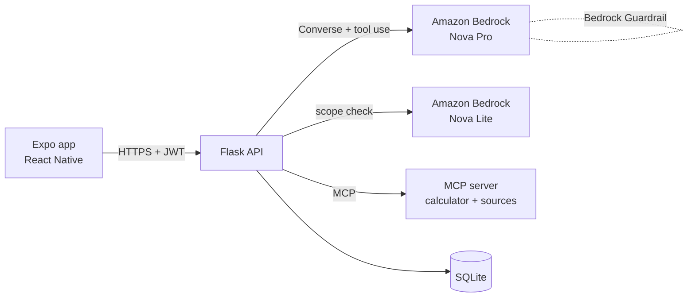

<div align="center">

# RightSize

**A calm, conversational way to find the life insurance coverage that fits your family.**

codeLinc 11 · Path 2: Life Insurance Needs Analyzer · Team BrokeBy30


</div>

## What it does
The user chats with an assistant about dependents, income, debts and existing coverage. The app then shows a
coverage goal, why each part of it is there, how the need shrinks over time, and how term and permanent
coverage fit their situation. Every number can be adjusted and traced to a published source.

**The assistant talks. Tested code calculates. The assistant explains.** The model never produces a number.

## Architecture

| Part | Location | Notes |
|---|---|---|
| Mobile app | `front-end/` | Expo, expo-router, TypeScript. Login, chat, results, history. |
| API | `back-end/app/` | Flask, SQLAlchemy, JWT auth, one JSON error shape. |
| Calculator | `back-end/mcp_server/` | Pure Python (DIME method) exposed as five MCP tools and two resources. |
| Chat layer | `back-end/app/ai/` | Bedrock Converse tool loop, guardrails, scripted fallback. |

## Security and safety
- **Accounts:** argon2 password hashing, short-lived JWT (HS256), token kept in the device's encrypted store.
- **Data:** only email, password hash and the answers typed. SSN-shaped numbers are removed before storage or any model call.
- **AI guardrails, four layers:** an input scope check that blocks off-topic and prompt-injection messages; a
  scope-first system prompt; a managed Amazon Bedrock Guardrail (investment advice, prompt attacks, PII);
  and an output check that rejects any dollar amount that did not come from the calculator.
- **Resilience:** if the model or MCP is unavailable, a scripted interview and the in-process calculator finish the assessment.
- **Advice boundary:** educational estimate only. No products, carriers or prices.

## Run it
```bash
# API (needs AWS_BEARER_TOKEN_BEDROCK in .env)
cd back-end && uv sync && uv run flask --app wsgi run --port 5000
uv run pytest -q                              # 38 tests
uv run python scripts/guardrail_check.py      # red-team against the live models

# App
cd front-end && npm install && npx expo start
```
Demo login: `demo@codelinc.app` / `Demo2026!`

## Deploy
One EC2 instance, Docker Compose, automatic HTTPS (Caddy):
1. Launch Ubuntu 24.04 in `us-east-2`, open ports 22, 80 and 443, paste `deploy/setup.sh` as user data.
2. On the instance: add the Bedrock key to `/opt/rightsize/deploy/.env`, then
   `cd /opt/rightsize/deploy && sudo docker compose up -d --build`.
3. Build the APK: `cd front-end && EXPO_PUBLIC_API_URL=https://<host> npx eas-cli build -p android --profile preview`.

## How it was built
Spec first: API contract (`docs/api.md`), calculator spec with a hand-worked persona (`docs/calculator-spec.md`),
task list (`docs/tasks.md`) and demo script (`docs/demo.md`). Assumptions are cited in
`back-end/mcp_server/data/assumptions.json` (NFDA, College Board).

## Costs and licensing
All libraries are open source. Running costs are Amazon Bedrock usage (Nova Pro, Nova Lite, Guardrails) and one small EC2 instance.
