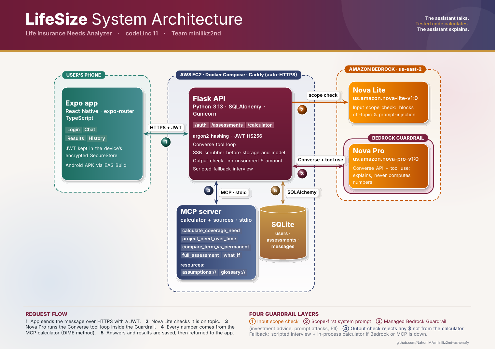
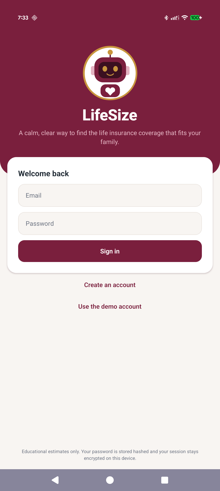
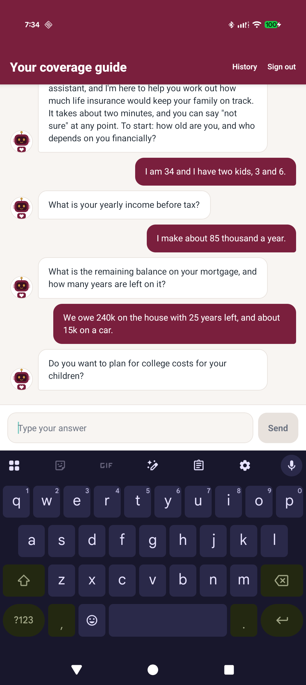
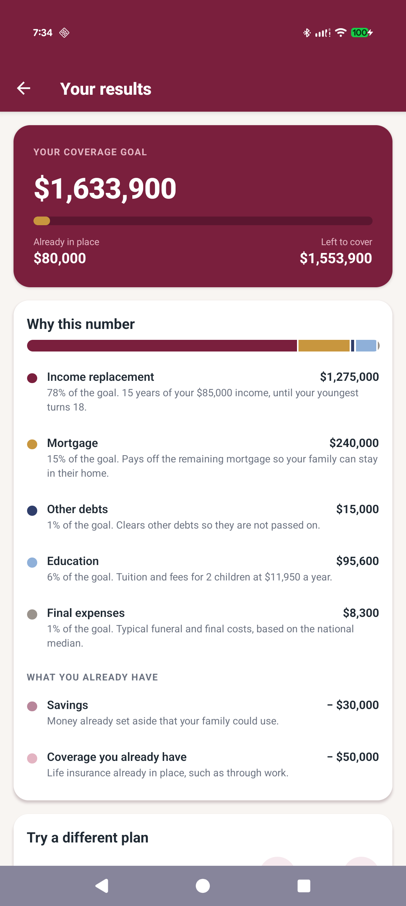
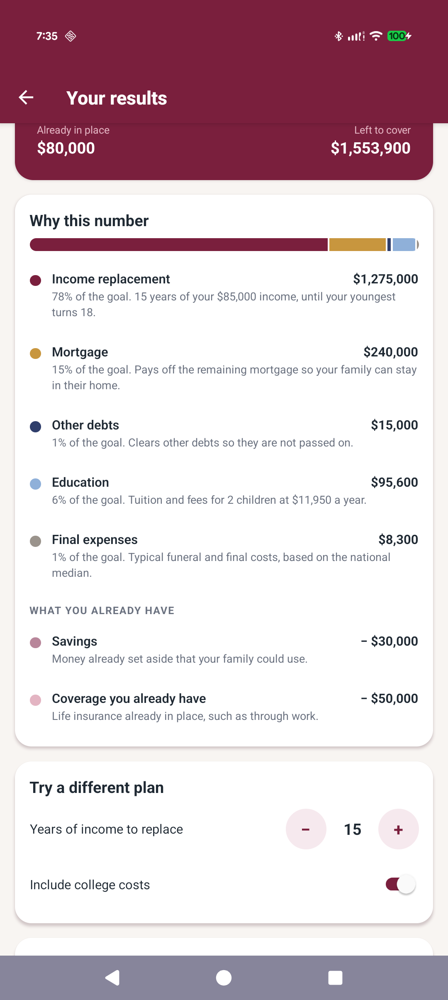
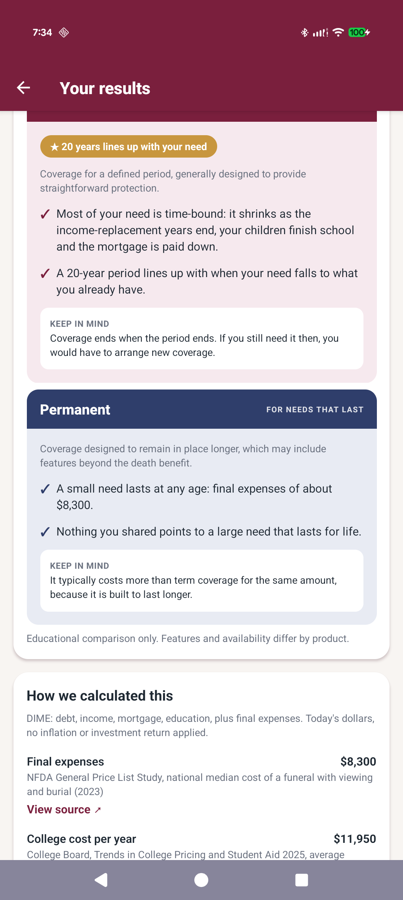

<div align="center">

# LifeSize

**A calm, conversational way to find the life insurance coverage that fits your family.**

codeLinc 11 · Path 2: Life Insurance Needs Analyzer · Team minilikz2nd


</div>

## Architecture
<p align="center">

</p>

Liv, the app's AI guide, asks about dependents, income, debts and existing coverage, one question at a time.
LifeSize then shows a coverage goal, why each part of it is there, how the need shrinks over time, and how term
and permanent coverage fit that person's situation.

**The assistant talks. Tested code calculates. The assistant explains.** The model never produces a number.

## Screens
<p align="center">





</p>

## Run it locally

You need Python 3.11+, [uv](https://docs.astral.sh/uv/), Node 20+, and an Amazon Bedrock API key with access to
Amazon Nova in `us-east-2`.

### 1. Add your key
Create a file named `.env` in the project root (next to this README):

```
AWS_BEARER_TOKEN_BEDROCK=<your Bedrock API key>
AWS_REGION=us-east-2
SECRET_KEY=<any random text, at least 32 characters>
BEDROCK_GUARDRAIL_ID=
```

- Get the key in the AWS console: Amazon Bedrock, then **API keys**, then generate a long-term key.
- `BEDROCK_GUARDRAIL_ID=` is left empty on purpose. The managed guardrail lives in our AWS account; an empty value
  switches that one layer off so the app runs in yours. To create the same guardrail in your account, run
  `uv run python scripts/create_guardrail.py` from `back-end/` and paste the two lines it prints into `.env`.
- No key at all? The app still works: the chat falls back to a scripted interview and the calculator runs as normal.

### 2. Start the back end
```bash
cd back-end
uv sync
uv run flask --app wsgi run --port 5000
```
Check it: `curl http://127.0.0.1:5000/health` returns `{"ok":true}`. A demo account is created on first start.

### 3. Start the front end
In a second terminal:
```bash
cd front-end
npm install
npx expo start
```
- **In a browser:** press `w`, or open http://localhost:8081.
- **On a phone:** install Expo Go, join the same Wi-Fi as the computer, and scan the QR code.

In development the app reaches the back end through the Expo server, so there is no address to configure.

### 4. Sign in
Tap **Use the demo account** (`demo@codelinc.app` / `Demo2026!`), or create an account.

### 5. Run the checks
```bash
cd back-end
uv run pytest -q                              # 45 tests, no AWS needed
uv run python scripts/guardrail_check.py      # red-team against the live models
uv run python scripts/demo_conversation.py    # the demo persona end to end
```

### Or run the API with Docker
```bash
docker build -t lifesize .
docker run -p 8000:8000 lifesize
```
It starts with no configuration; open http://localhost:8000 for the service description. Add
`-e AWS_BEARER_TOKEN_BEDROCK=<key> -e BEDROCK_GUARDRAIL_ID=` to use the live models.

## Where to look
| To see | Open |
|---|---|
| The math (DIME method, projection, term logic) | `back-end/mcp_server/calculator.py` |
| The MCP tools and resources the model can call | `back-end/mcp_server/server.py` |
| How a chat turn runs: guardrails, tool loop, fallback | `back-end/app/ai/service.py` |
| Everything the models are told | `back-end/app/ai/prompts.py` |
| Input and output checks | `back-end/app/ai/guardrails.py` |
| Auth: argon2, JWT, the `authentication_required` decorator | `back-end/app/security.py`, `back-end/app/auth.py` |
| The results screen | `front-end/src/app/results.tsx` |
| The single API client and token storage | `front-end/src/lib/api.ts`, `front-end/src/lib/token-store.ts` |
| Tests, including the hand-worked persona | `back-end/tests/` |
| The API contract and calculator spec | `docs/api.md`, `docs/calculator-spec.md` |

## Security and safety
- **Accounts:** argon2 password hashing, short-lived JWT (HS256), token kept in the device's encrypted store, HTTPS only.
- **Data:** only email, password hash and the answers typed. SSN-shaped numbers are removed before storage or any model call.
- **AI guardrails in layers:**
  1. an input scope check that blocks off-topic and prompt-injection messages before the main model sees them
  2. a scope-first system prompt
  3. a managed Amazon Bedrock Guardrail (investment advice, prompt attacks, hate, PII)
  4. an output check that rejects any dollar amount that did not come from the calculator
- **Decided in code, not by the model:** users under 18 are turned away kindly, and a message suggesting self-harm
  gets a fixed reply with the 988 Suicide and Crisis Lifeline.
- **Resilience:** if the model or MCP is unavailable, a scripted interview and the in-process calculator finish the assessment.
- **Advice boundary:** educational estimate only. No products, carriers or prices.

## Deploy
One EC2 instance, Docker Compose, automatic HTTPS (Caddy):
1. Launch Ubuntu in `us-east-2`, open ports 22, 80 and 443, paste `deploy/setup.sh` as user data.
2. On the instance: add the Bedrock key to `/opt/rightsize/deploy/.env`, then
   `cd /opt/rightsize/deploy && sudo docker compose up -d --build`.
3. Build the APK: `cd front-end && npx eas-cli build -p android --profile preview` (the API address is set in `eas.json`).

## How it was built
Spec first: an API contract, a calculator spec with a persona worked by hand, and a task list (`docs/`).
Assumptions are cited in `back-end/mcp_server/data/assumptions.json` (NFDA, College Board).
The mascot and app icon are original, generated by `front-end/scripts/make-assets.py`.

## Costs and licensing
All libraries are open source. Running costs are Amazon Bedrock usage (Nova Pro, Nova Lite, Guardrails) and one small EC2 instance.
